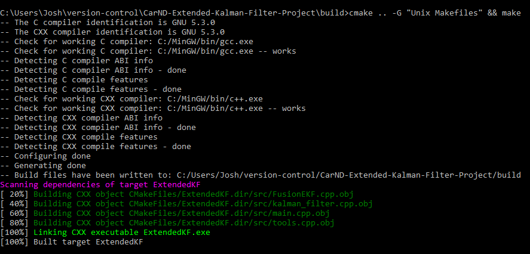
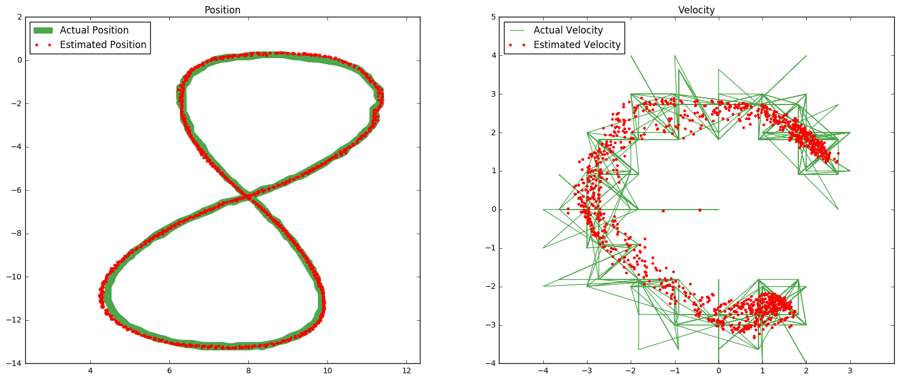
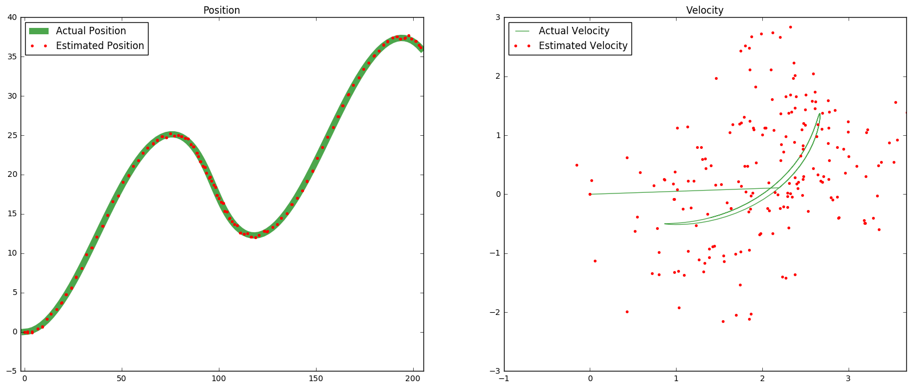
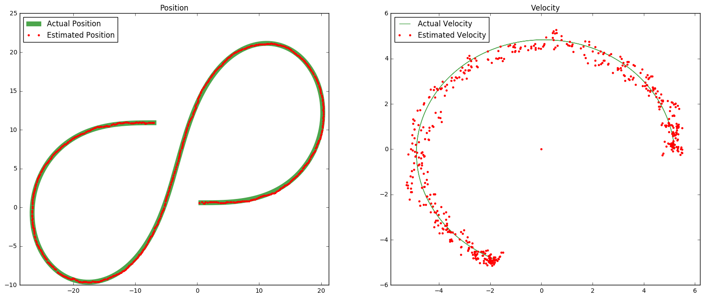

# Extended Kalman Filter Project
Self-Driving Car Engineer Nanodegree Program

Josh Smith

2017/04/19

---

## Dependencies

* cmake >= 3.5
 * All OSes: [click here for installation instructions](https://cmake.org/install/)
* make >= 4.1
  * Linux: make is installed by default on most Linux distros
  * Mac: [install Xcode command line tools to get make](https://developer.apple.com/xcode/features/)
  * Windows: [Click here for installation instructions](http://gnuwin32.sourceforge.net/packages/make.htm)
* gcc/g++ >= 5.4
  * Linux: gcc / g++ is installed by default on most Linux distros
  * Mac: same deal as make - [install Xcode command line tools]((https://developer.apple.com/xcode/features/)
  * Windows: recommend using [MinGW](http://www.mingw.org/)

## Basic Build Instructions

1. Make a build directory: `mkdir build && cd build`
2. Compile: `cmake .. && make` 
   * On windows, you may need to run: `cmake .. -G "Unix Makefiles" && make`
3. Run it: `./ExtendedKF path/to/input.txt path/to/output.txt`. You can find
   some sample inputs in 'data/'.
    - eg. `./ExtendedKF ../data/sample-laser-radar-measurement-data-1.txt output.txt`

## Rubric

### Compile

Compiling during development and testing was accomplished through Visual Studio 2017.  Basic compile instructions can be found above.

### Accuracy

ExtendedKF was run on three datasets comprised of lidar and radar measurements.  The RMSE error for each data set is shown below.

#### sample-laser-radar-measurement-data-1

​	**RMSE**
​	0.0651243
​	0.0605982
​	0.530249
​	0.544262

#### sample-laser-radar-measurement-data-2

​	**RMSE**
​	0.185498
​	0.1903
​	0.476578
​	0.804726

#### obj_pose-laser-radar-synthetic-input

​	**RMSE**
​	0.0975411
​	0.0852351
​	0.434453
​	0.453103

### Algorithm 

#### Flow

The general flow of the Kalman filter is outlined below.

##### First Measurement

The filter can have either a laser or radar measurement for initialization.  These measurements are treated differently as the laser measurement returns information in a Cartesian coordinate system and lacks velocity data and the radar measurement returns information in a polar coordinate system and contains radial velocity information.  The covariance matrix is initialized differently based on this initial measurement type.

Since the laser excels at positional accuracy the initial variance of px and py are set low.  However, a single lidar measurement does not give any information about velocity so the variance for vx and vy are set high. 

px = py = 0.5

vx = vy = 100

If the first measurement is radar the positional variance is set slightly above that of the laser measurement since radar does not provide the positional accuracy of laser.  The velocity is set low since a single measurement of radar does provide information of velocity.

px = py = 10

vx = vy = 0.5

##### Predict and Update

After the filter is initialized with the first measurement the filter enters a loop of predict and update with each measurement.  Prediction is done in `FusionEKF` on lines 124-135.  After prediction is complete the measurement update is done in `FusionEKF.cpp` on lines 140-162.

##### Radar and Lidar Measurements

Radar and Lidar need to be treated differently in the Kalman filter since the Radar is a taken in a polar coordinate system and utilizes a Extended Kalman Filter.  This distinction is made in `FusionEKF.cpp` on line 140.

### Code Efficiency

Efforts were made  to avoid repeating calculations and inserting unnecessary control flow checks throughout the code.  Executing the ExtendedKF on the 500 samples in the `obj_pose-laser-radar-synthetic-input` data set requires 569ms to load and execute.  The actual filter routine contained within `fusionEKF.ProcessMeasurement` on line 139 in `main.cpp` represents 50.27%.  This represents a processing rate of 1,748 measurements processed per second.